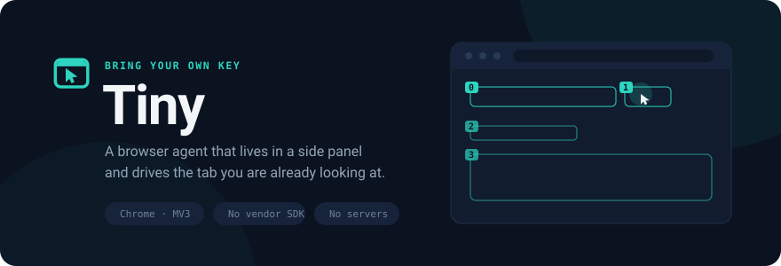
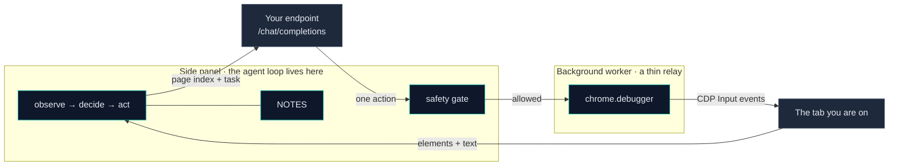
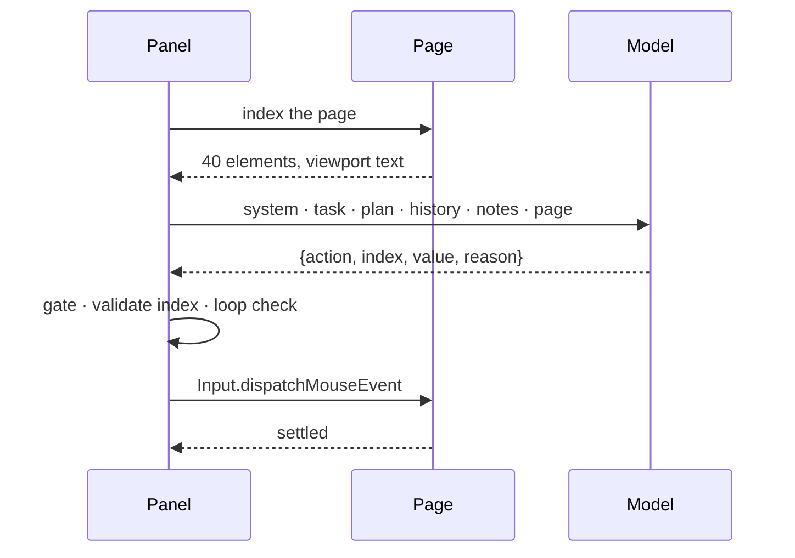

<div align="center">



<p>
  
  
  
  
</p>

<p>
  <a href="#quick-start">Quick start</a> ·
  <a href="#bring-your-own-key">Bring your own key</a> ·
  <a href="#how-it-works">How it works</a> ·
  <a href="#what-tiny-will-not-do">Safety</a> ·
  <a href="#evaluating-it">Benchmarks</a> ·
  <a href="#contributing">Contributing</a>
</p>

</div>

---

Tiny takes a plain-English task and does it in the tab you are already looking at.
It reads the page, decides one action, performs it as a real mouse or keyboard event,
then looks again — until it has an answer for you or a reason it cannot get one.

It runs entirely on your machine against **any OpenAI-compatible endpoint**: a hosted
gateway, a local LM Studio or Ollama, whatever you point it at. There is no Tiny
account, no proxy, and no server in the middle. Your key is typed into the panel and
stored in the browser's own extension storage — it is never bundled, logged, or sent
anywhere except the endpoint you named.

**Tiny injects nothing into the pages you visit.** There is no content script and no
`content_scripts` entry in the manifest. Everything that runs inside a page goes
through a DevTools Protocol session you can see, on a tab you pointed it at, and it
stops when that session closes.

## Quick start

```bash
git clone https://github.com/Rio-awsm/tiny-brow-ai-browser-use-agent
cd tiny-brow-ai-browser-use-agent
npm install
npm run dev
```

WXT opens a browser with the extension loaded. Click the Tiny icon to open the side
panel, then **Settings** to add an endpoint, a key and a model name. Press **Test
connection** — it does a real round trip and tells you exactly what came back.

Then type something into the composer and press Run:

> *Find the Wikipedia article on Chandrayaan-3 and give me the first paragraph.*

For a production build: `npm run build`, then load `.output/chrome-mv3` unpacked from
`chrome://extensions` with Developer mode on.

## Bring your own key

Tiny speaks `POST /chat/completions` and nothing else. That one surface is what makes
BYOK real rather than aspirational — LM Studio, Ollama, Groq, OpenRouter, LiteLLM,
Together and Google's compatibility mode all implement it, so all of them work without
a line of vendor code.

Presets ship for the endpoints below. Everything else — Ollama, Together, vLLM, a
company gateway — goes in as **Custom**: paste a base URL, a key if it needs one, and
a model name.

| Preset | Base URL |
|---|---|
| **LM Studio** | `http://127.0.0.1:1234/v1` |
| **LiteLLM** | `http://127.0.0.1:4000/v1` |
| **Groq** | `https://api.groq.com/openai/v1` |
| **OpenRouter** | `https://openrouter.ai/api/v1` |
| **Google AI Studio** | `https://generativelanguage.googleapis.com/v1beta/openai` |
| **Custom** | whatever you paste |

A preset is [data](src/lib/provider/presets.ts) — a base URL, some suggested models,
and any default parameters. That file is the only place in the codebase where a
provider is named; no other code branches on which one you picked, which is why adding
one is a few lines rather than an integration.

Tiny asks Chrome for permission to reach your endpoint's origin **when you save it**,
not at install time. A fresh install can reach nothing.

### What the model has to support

Structured output — `response_format: { type: "json_schema", strict: true }`. Tiny
constrains decoding to its action schema rather than using tool calling, because tool
calls fail silently and completely through OpenAI-compatible layers when a chat
template does not match. If your endpoint rejects the schema, the panel says so in
those words instead of failing as a bad answer.

## How it works



**The loop runs in the side panel, not the background worker.** An MV3 service worker
is evicted after roughly thirty seconds idle, and a thirty-step task waiting on a slow
model is idle almost all of it. A worker-hosted loop dies mid-run for reasons that look
exactly like the model failing. The panel is a real document with a real lifetime, so
the loop lives there and the worker stays a relay.

### One step



The page is reduced to a numbered list of things that can actually be interacted with —
visible, hit-testable, not covered by something else — capped at 40, viewport-first.
The model picks a number. Nothing about the DOM reaches the model, so nothing about the
DOM can be hallucinated at it.

### Acting like a person

Every click and keystroke is dispatched through `Input.dispatchMouseEvent` and
`Input.dispatchKeyEvent`. Never `element.click()`, never a synthetic DOM event: those
arrive with `isTrusted: false`, and the bot-detection layer on every site worth
automating checks that flag. A real CDP event is indistinguishable from a hand on the
mouse because at the browser's level it *is* one.

Before each read, a three-layer wait — frames finished loading, then network quiet, then
the DOM stable — so a step never reasons about a half-rendered page.

### Keeping step 30 as cheap as step 3

| | |
|---|---|
| **History** | One line per past step. Never a past page state. |
| **Index** | Only ever the current page, capped at 40 elements. |
| **Page text** | Centred on the viewport, not sliced from the top of the document. |
| **NOTES** | The one block allowed to grow: every extracted fact, verbatim. |
| **System prompt** | Byte-identical on every call, so the provider's prefix cache hits. |

Everything that varies sits at the end of the prompt, behind everything that does not.
`npm run plot:tokens` charts prompt tokens per step from a scored run and shades how
much of each step the provider served from its own cache — the claim is either flat in
those numbers or it is not.

NOTES exists because history lines are truncated summaries. A model that found three
prices twenty steps ago cannot read them back out of a summary, and what it does
instead is re-extract the first one forever, or leave a site without taking the fact it
went there for.

## What Tiny will not do

The gate is [code](src/lib/agent/safety.ts), deliberately, not a prompt rule. A model
reading forty steps of history forgets what it was told at the top; a function does
not. Every proposed action passes through it before anything else looks at the action.

**Refused outright, with no way to approve it:**

| | |
|---|---|
| Passwords, PINs, OTPs, CVVs, card numbers, UPI PINs | You type those, in the tab. |
| Sign-in, registration and OAuth flows | Recognised from the URL. Tiny stops and asks you. |
| Any action justified by quoting the page's own instructions | See below. |
| Any site outside the run's allowed list | Off by default; an allow list of host globs when you turn it on. |

**Held until you click Allow:** spending money and destroying things — *pay now*,
*place order*, *checkout*, *buy now*, *confirm order*, *transfer*, *withdraw*,
*delete*, *close account*, *unsubscribe*. Matched on the element's visible label and,
independently, on the destination URL, so a checkout reached by link is caught the same
way as one reached by button.

Not on form mechanics. A bare *submit* was on that list for one afternoon and it gated
**every search box on the web** — "Go" on Amazon is an `<input type="submit">`, and the
indexer notes the input's type. A gate that stops ordinary work is a gate you turn off,
which protects nobody.

The approval card names the verb, the element's own label and the page it is on,
because an approval that only says *continue?* trains you to click yes. Nothing is
pre-selected. **With nobody watching, it refuses rather than allows.**

Banks are handled by the allow list rather than a list of banks. Naming the domains to
keep out is a game you lose; naming the ones a task needs is finite, and it is also
what stops a grocery task wandering into your email.

### Prompt injection

Tiny runs inside a browser signed in to everything you own, and a page can contain text
addressed to it. Page text arrives fenced in `<page_content>`, and the system prompt
declares everything inside those fences to be untrusted data that is never an
instruction.

Behind that sits a layer that does not depend on the model remembering. Every page is
scanned for text shaped like an instruction — *ignore all previous instructions*, *you
are now*, *do not tell the user* — and when any is found the model is told, in the first
line it reads, that the page is trying it. If the model's own stated reason for an
action turns out to be quoting one of those spans back, the action is refused before it
dispatches, whatever it was.

## Getting unstuck

The failure that ends most browser-agent runs is not a wrong click, it is the same
wrong click thirty times. Tiny answers that in code:

| | |
|---|---|
| **Nothing changed** | URL, scroll position and the whole element list are fingerprinted. An action that moved none of them is reported to the model in words — it is shown a page, not a diff. |
| **Same choice twice** | The element is named and forbidden. |
| **Same choice three times** | Escape, then a click on the backdrop, then a rewritten plan, then it hands the run to you. |
| **Bad element number** | Re-prompted with the valid range. The retry does not consume a step. |
| **Off-schema reply** | Retried twice. One bad decode is a provider hiccup, not a failed task. |
| **`fail` on the first attempt** | Challenged once. Models give up while their own stated reason names the next thing to try. |
| **A sign-in wall** | Handed to you, with the run paused rather than abandoned. Sign in yourself, then continue. |

The backdrop click is the only place in the codebase that clicks a raw coordinate
instead of a listed element — deliberately, because the close button that defeats an
agent is the one with no accessible name. It never reaches the index, so no amount of
prompting can make a model click it. A candidate point is rejected if it lands on the
modal or on any listed element; if none is safe, nothing is clicked.

## Plan, navigate, check

Three roles, because they want different models:

| Role | Called | Wants |
|---|---|---|
| **Planner** | Once at the start, once more if the run gets stuck | A stronger model. It runs twice a run against a step cap of forty. |
| **Navigator** | Every step | Cheap and fast. This is where the entire cost of a run is. |
| **Validator** | When the agent says it is done | Almost anything. Its prompt is tiny. |

A route is nothing but `(base URL, key, model, extra params)` — the same triple the
provider layer already speaks — so the navigator can run on a local model while the
planner reaches for a hosted one in the same run. Each role falls back field by field
to your single configured provider, so the feature costs nothing until you want it. A
key belongs to an endpoint: a route naming a different base URL does not inherit it.

The **validator** exists because premature completion is the most expensive failure a
browser agent has — it does not look like a failure. The run ends green, the transcript
reads sensibly, and the answer is *"I will now look for the price"*. The model that
spent thirty steps convincing itself is the worst possible judge of that, so the check
is a separate call that sees only the task, the notes and the final page.

## Evaluating it

Prompt tuning without a scoreboard is guessing. Tiny ships with a ten-task suite and a
harness that drives the real extension in a real browser and scores what comes back.

```bash
npm run fixtures                                    # local pages for the recovery task
npx tsx harness/index.ts --driver bridge --provider lmstudio
npm run plot:tokens                                 # prompt tokens per step
```

In the browser: **Settings → Connect to the scoring harness**. The panel polls a local
bridge for tasks and runs them unattended — which is also why the safety gate refuses
rather than allows when nobody is there to click Allow.

Tasks run from `example.com` through a Wikipedia lookup and an Amazon search to a
two-site price comparison and a deliberately hostile fixture with a cookie banner over
a login wall. Failures are named rather than counted: `step_cap`, `rate_limit`,
`schema_rejection`, `invalid_index`, `needs_user`, `provider_error`. "Unknown" tells
you nothing about whether the model, the endpoint or the page was at fault.

`npm run matrix` scores the same suite across several backends and prints where they
disagree — the tasks one model passes and another does not are where the interesting
differences live.

## Project layout

```
src/
  entrypoints/
    background/       service worker: a message relay, nothing more
      cdp.ts          the DevTools session: attach, detach, lifecycle
      extract.ts      the injected page indexer
      overlay.ts      the injected highlight overlay
      actions.ts      click, type, key, scroll, navigate over CDP Input
      cursor.ts       the injected animated cursor
      settle.ts       the waiting layer: network quiet, then DOM stability
    sidepanel/        the React panel — where the agent loop runs
  components/         panel UI, cards, and shadcn-style primitives
  lib/
    settings.ts       step cap, roles, firewall
    agent/
      schema.ts       the eight verbs, and what a well-formed action is
      prompt.ts       prompt assembly, in a fixed order
      loop.ts         observe, decide, act — with repair, retry, loop breaking
      safety.ts       refusals, approvals, the firewall, injection
      planner.ts      the plan, written once and again when stuck
      validator.ts    the second opinion
      roles.ts        a route is (base URL, key, model, extra params)
    provider/         the BYOK layer: one implementation, presets as data
harness/              the scoring suite: bridge, runner, matrix, report
scripts/              checks, fixtures, token plots, icon generation
```

## Development

```bash
npm run dev            # Chrome, hot reload
npm run dev:edge       # Edge
npm run build:all      # both outputs
npm run check          # everything below, in order
```

| | |
|---|---|
| `check:loop` | The agent loop against a scripted model — no browser, no key, no cost. Fifty-odd cases pinning what it refuses, when it pushes back, what it answers with. |
| `check:secrets` | No credential can reach the extension bundle. A build-time environment value would be inlined into the published output and shipped to every user. |
| `check:extractor` | Every injected function is pulled back out of the *built* bundle and run against a stub DOM. Bundler hoisting breaks injected code silently, at runtime, in the page. |
| `check:chars` | No control characters in source. A backspace byte written where `\b` was meant reads as a word boundary in every editor and matches nothing at runtime. |
| `verify:tasks` | The task list and its machine-readable twin agree. |

## Browser support

Chromium only, and that is architectural rather than a gap: everything rests on
`chrome.debugger`, which Firefox does not expose to extensions at all.

| Browser | |
|---|---|
| Chrome | `npm run dev`, `npm run build` |
| Edge | `npm run dev:edge`, `npm run build:edge` — same code, same manifest |
| Brave, Opera, Vivaldi | load the `chrome-mv3` build unpacked |
| Firefox, Safari | not possible |

`chrome.sidePanel` is the one API that is not universal. Where it is missing the panel
opens in a popup window instead.

## Contributing

Issues and pull requests are welcome.

```bash
npm install
npm run check     # must pass
npm run dev
```

Two things worth knowing before you start:

**Anything injected into a page must be self-contained.** It is stringified with
`Function.toString()` and evaluated in the page, so it cannot close over anything in its
module. A bundler will happily hoist a shared constant out of one and the failure is
silent, at runtime, in a page you are not looking at. `npm run check:extractor` catches
it; keep helpers nested inside the injected function.

**Behaviour changes want a case in `scripts/loop-cases.ts`.** It replaces the model with
a list of scripted replies and the browser with a page that only changes when the case
says it does, so a change to how the loop pushes back or what it refuses can be pinned
in a second for nothing, instead of ten minutes against a paid endpoint.

## License

[MIT](LICENSE).
